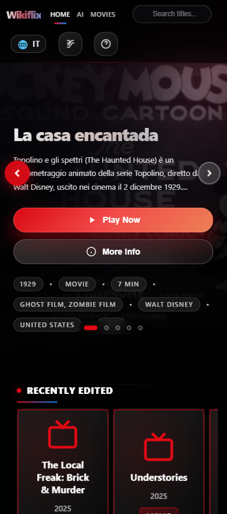
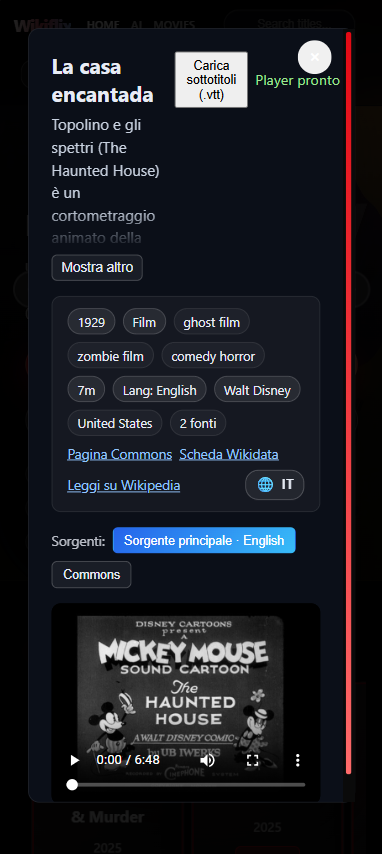
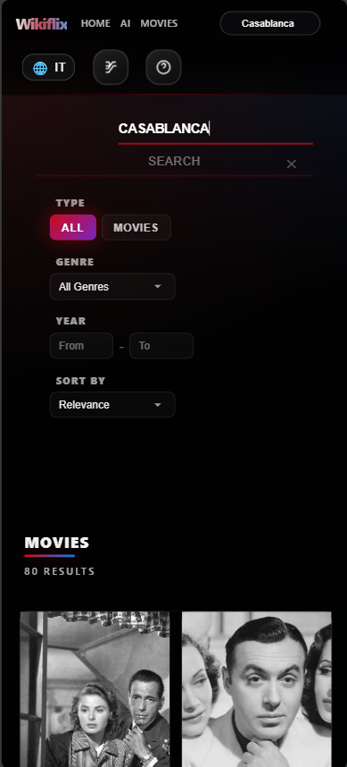

# 🎬 Wikiflix

Wikiflix è un'app di streaming stile Netflix interamente client-side. Usa solo fonti aperte (Wikidata/Wikimedia Commons, Libreflix, Vimeo, YouTube, Internet Archive) e un catalogo statico generato offline con embedding semantici per la ricerca.

Tale catalogo può però essere aggiornato automaticamente tramite lo script `tools/build_catalog.py`.

### Anteprima dell'applicazione

| Home Screen | Scheda Film (Movie Card) | Ricerca Semantica |
| --- | --- | --- |
|  |  |  |

---

## 🚀 Cosa offre

* **Frontend only**: React + TypeScript + Vite, nessun backend proprietario.
* **Catalogo open**: film con P10/P1651/P4015/P6614/P724 e filtri di dominio pubblico da Wikidata/Commons.
* **Player con sorgenti alternative**: Commons, Libreflix, Vimeo, YouTube, Internet Archive.
* **Metadati arricchiti**: registi, paesi, generi, lingua, durata, poster; hero/player/info mostrano direttori e paesi.
* **Ricerca locale**: catalogo JSONL + indice ANN HNSW e FTS client-side (fusion ANN/FTS per ricerca ibrida).
* **Multilingua**: labels/descrizioni preferite dalla lingua utente con fallback; selector lingua in UI.

---

## 🏗️ Architettura in breve

* **Build-time**: [tools/build_catalog.py](https://www.google.com/search?q=tools/build_catalog.py) esegue SPARQL su Wikidata, arricchisce le label con `wbgetentities`, normalizza le URL sorgenti e genera catalogo + embedding + indice ANN.
* **Runtime**: il client carica gli artifact statici da `public/catalog/` (manifest, JSONL, embeddings, HNSW). La ricerca ora usa solo catalogo locale: filtri strutturati (tipo/anno/genere/paese) + score semantico/testuale, nessuna chiamata live a TMDB/Wikidata.
* **Dati ammessi**: film con almeno una sorgente video aperta; esclusi trailer e elementi non film (vedi query in [DATA_INTEGRATION_TECHNICAL_README.md](https://www.google.com/search?q=DATA_INTEGRATION_TECHNICAL_README.md)).

---

## 💻 Avvio rapido (app)

1. Node 18 (vedi [.nvmrc](https://www.google.com/search?q=.nvmrc)).
2. `npm install`
3. `npm run dev` → `http://localhost:5173`

> [!NOTE]
> Non servono API key esterne per i contenuti open attuali.

---

## 🛠️ Generare il catalogo offline (manuale)

1. Python 3.10+ con venv attivo.
2. `python -m pip install -r tools/requirements.txt`
3. `python tools/build_catalog.py --out data/catalog --model intfloat/multilingual-e5-small --device cpu`

**Output in `data/catalog/`:**

* `catalog.jsonl`: righe tipo `Content` con sorgenti alternative e metadati.
* `embeddings.f32`: matrice float32 normalizzata (row-major).
* `hnsw.index`: indice ANN cosine.
* `ids.txt`: QID per riga (ordine allineato).
* `manifest.json`: metadati modello/file/dimensioni.

**Deploy app**: copia i file in `public/catalog/` (già referenziati da `searchCatalog`/loader). Nessuna API key esterna richiesta per la ricerca.

Puoi passare `--query` per usare una SPARQL personalizzata o `--device cuda` se disponibile.

---

## 📚 Documentazione di supporto

* [DATA_INTEGRATION_TECHNICAL_README.md](https://www.google.com/search?q=DATA_INTEGRATION_TECHNICAL_README.md) — pipeline dati, query SPARQL, norme URL.
* [PROJECT_OVERVIEW_README.md](https://www.google.com/search?q=PROJECT_OVERVIEW_README.md) — visione e principi client-side.
* [PLATFORM_ADAPTATION_README.md](https://www.google.com/search?q=PLATFORM_ADAPTATION_README.md) — note per web/mobile/TV.
* [ROADMAP_TODO_README.md](https://www.google.com/search?q=ROADMAP_TODO_README.md) — stato lavori e step successivi.
* [WIKIFLIX_UI_STRUCTURE_README.md](https://www.google.com/search?q=WIKIFLIX_UI_STRUCTURE_README.md) — struttura UI e categorie.

---

## ⚖️ Licenza e note legali

* Codice rilasciato sotto **MIT** (vedi [LICENSE](https://www.google.com/search?q=LICENSE)).
* I contenuti video provengono da fonti aperte (Wikimedia Commons, Libreflix, Vimeo, YouTube, Internet Archive). Verifica sempre i diritti d'uso per ogni asset; l'app non ospita media proprietari.
