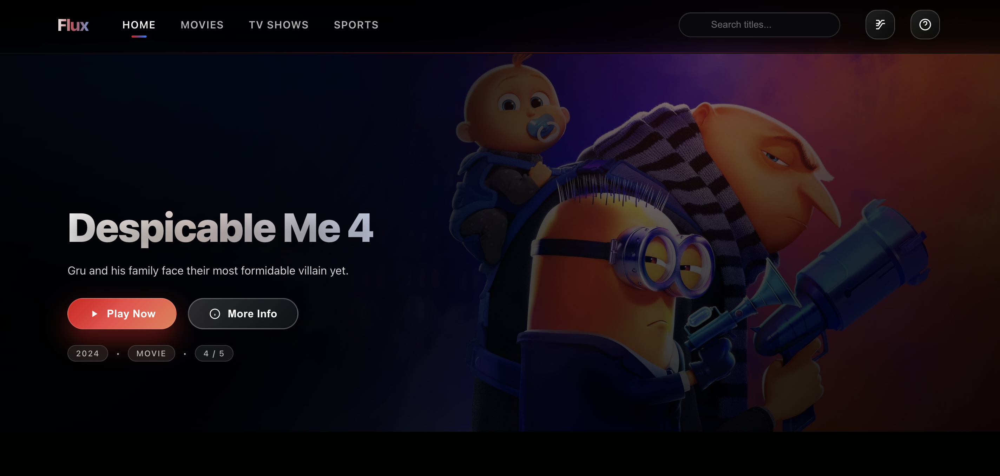
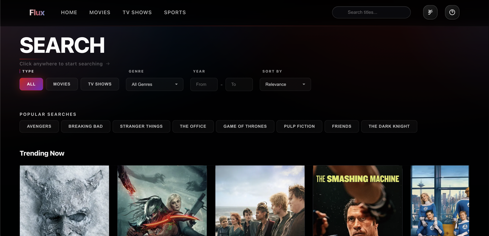
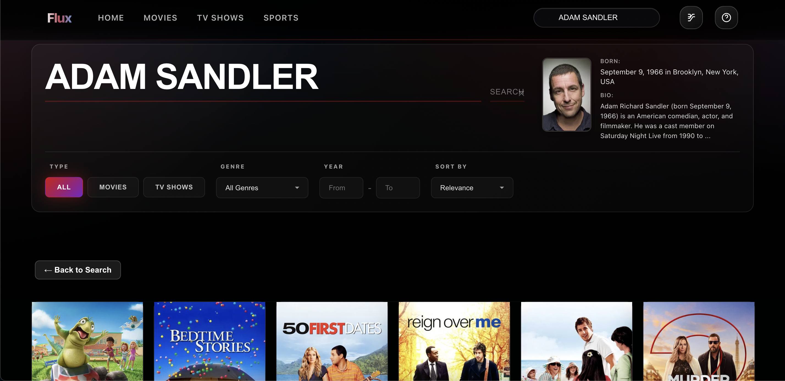

# 🎬 Flux

A Netflix-inspired streaming platform UI built with React, TypeScript, and Vite.

[](https://reactjs.org/)
[](https://www.typescriptlang.org/)
[](https://vitejs.dev/)
[](LICENSE)

<div align="center">
  
  <p><em>Home page with featured content hero section</em></p>
  
  
  <p><em>Advanced search with filters and trending content</em></p>
  
  
  <p><em>Movies page with categorized content</em></p>
</div>

## Features

- 75,000+ movies and TV shows via TMDB API
- Netflix-inspired UI/UX design
- Advanced search with actor profiles
- Progress tracking and watch list
- Live sports streaming
- Fully responsive design
- Type-safe with TypeScript

## Quick Start

```bash
git clone https://github.com/Ennyw/flux.git
cd flux
npm install

# Add your TMDB API key to .env
# Get free key: https://www.themoviedb.org/settings/api

npm run dev
```

Open [http://localhost:3000](http://localhost:3000)

> 💡 **Want to showcase this?** Deploy to Vercel/Netlify and add the live demo link here!

## Setup

1. Get a free TMDB API key: https://www.themoviedb.org/settings/api
2. Create `.env` file:
   ```env
   VITE_TMDB_API_KEY=your_key_here
   ```
3. Run `npm run dev`

## Tech Stack

React 18 • TypeScript • Vite • TMDB API • TheSportsDB

## Learn From This Project

- Modern React patterns (hooks, context)
- TypeScript best practices
- API integration with TMDB
- Responsive design patterns
- Component architecture
- State management

## Documentation

- [Setup Guide](SETUP.md) - Complete setup instructions
- [Contributing](CONTRIBUTING.md) - How to contribute
- [Security](SECURITY.md) - Security policy

## Third-Party Services

This project uses third-party APIs:

- **TMDB API** - Movie/TV metadata (free API key required)
- **TheSportsDB API** - Sports data (optional)
- **Vidking API** - Video streaming for movies/TV shows (third-party service)
- **ppv.to API** - Video streaming for sports (configured via VITE_STREAMS_API_URL)

⚠️ **Critical Legal Notice**: 
- This project was **AI-generated** using AI development tools
- Video content is streamed through **Vidking** (movies/TV) and **ppv.to** (sports) or other third-party APIs, which the developer has no control over
- The developer has **no knowledge** of what content these services provide
- The developer **does not endorse** any third-party streaming services
- You are **solely responsible** for compliance with all applicable copyright laws
- The developers are **absolved of all liability** for content accessed through third-party APIs
- This project is intended for **local/private use** only

**The developer is not responsible for third-party API content or services.**

See [DISCLAIMER.md](DISCLAIMER.md) for complete legal information.

## License

MIT License - see [LICENSE](LICENSE)

## Disclaimer

**AI-Generated Project**: This entire project was created using AI-assisted development tools (Cursor/Composer AI).

This project is for **educational purposes only**. It is a UI/UX demonstration showcasing modern web development techniques. No copyrighted content is hosted or distributed. 

**The developer has no control, knowledge, or responsibility for content provided by third-party APIs (including Vidking and ppv.to). This project was AI-generated. Users are solely responsible for compliance with all applicable laws, terms of service, and copyright regulations when using third-party APIs and services.**

---

**Made with React + TypeScript + Vite**
